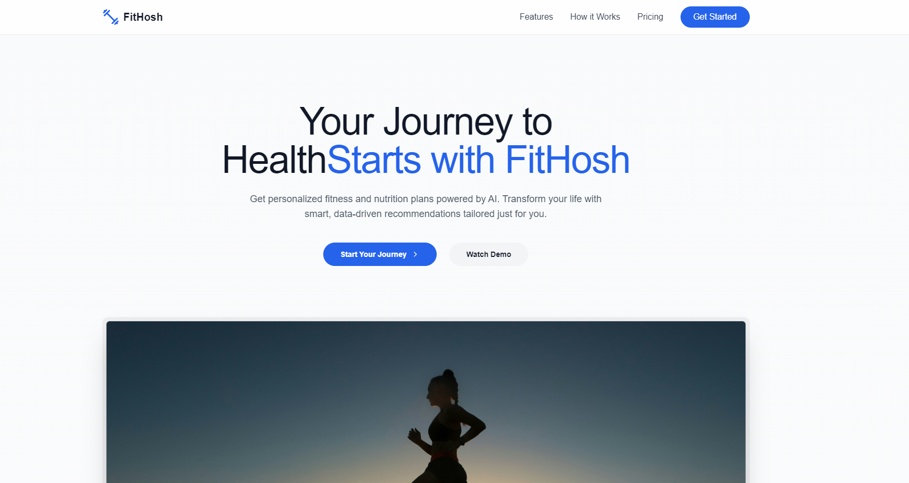

# FitHosh: AI-Powered Fitness and Nutrition Platform

<p align="center">
  
</p>

FitHosh is a cutting-edge SaaS platform that leverages advanced AI technologies to provide personalized fitness, health, and nutrition guidance. Our mission is to make professional-level health and fitness advice accessible to everyone, using the power of deep learning, neural networks, CNNs, and RNNs.

## Key Features

### 🏋️ Personalized Fitness and Nutrition Guidance
- AI-driven workout plans tailored to individual goals and body types
- Adaptive meal plans and diet recommendations
- Predictive modeling for fitness journey trends

### 🥗 Smart Meal & Recipe Recommendations
- AI-powered high-protein and nutrient-dense recipe suggestions
- Custom meal plans for various dietary needs (vegetarian, vegan, keto, etc.)
- Calorie and macro tracking with AI-assisted insights

### 💬 Real-Time AI Health Assistant
- Instant answers to health and fitness queries
- Automatic recipe generation based on preferences and dietary history

### 📊 Intelligent Progress Tracking
- Computer vision analysis of progress photos
- Personalized dashboard with deep learning insights on body composition changes

### 🧘 Health-Conscious Lifestyle Recommendations
- AI-driven suggestions for sleep, hydration, and mindfulness activities
- Holistic health monitoring and habit formation guidance

## Tech Stack

### Backend
- Python (TensorFlow, Keras, PyTorch)
- FastAPI / Django
- MongoDB Atlas / PostgreSQL

### AI Models
- Custom CNN and RNN models
- Pre-trained models from Hugging Face and Google Colab

### Frontend
- React.js
- TailwindCSS

### Deployment
- Frontend: Netlify / Vercel
- Backend: Heroku / Render

### External APIs
- Edamam / Spoonacular for nutrition data and recipes

### Analytics
- Google Analytics
- Custom AI-powered health monitoring tools

## Getting Started

1. Clone the repository
   ```
   git clone https://github.com/yourusername/fithosh.git
   ```
2. Install dependencies
   ```
   cd fithosh
   npm install
   ```
3. Set up environment variables (see `.env.example`)
4. Run the development server
   ```
   npm run dev
   ```

## Contributing

We welcome contributions to FitHosh! Please see our [CONTRIBUTING.md](CONTRIBUTING.md) for details on how to get started.

## Business Model

FitHosh operates on a freemium model:
- Free tier: Basic workout suggestions, meal plans, and weight tracking
- Premium tier: Advanced AI insights, real-time progress analysis, and personalized recipes

We also partner with fitness brands and health services for affiliate marketing opportunities.

## Roadmap

- [x] MVP with basic workout and diet recommendations
- [ ] Integration of computer vision for progress photo analysis
- [ ] Launch of premium features
- [ ] Partnerships with fitness and nutrition brands
- [ ] API for third-party integrations

## License

This project is licensed under the MIT License - see the [LICENSE.md](LICENSE.md) file for details.

## Contact

For any queries, please reach out to us at support@fithosh.com or visit our website [www.fithosh.com](https://www.fithosh.com).

Join us in revolutionizing personal health and fitness with the power of AI!
